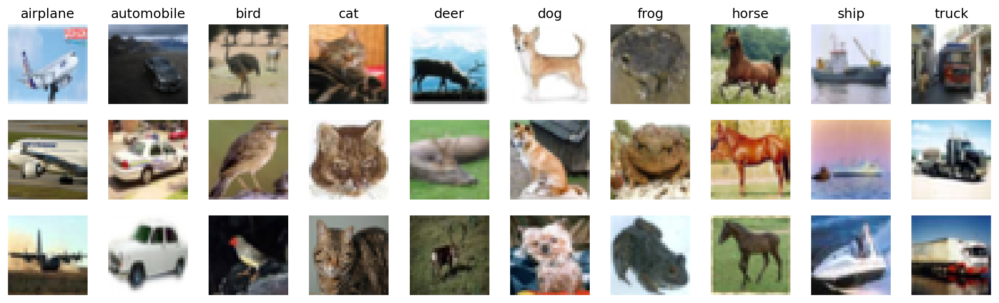
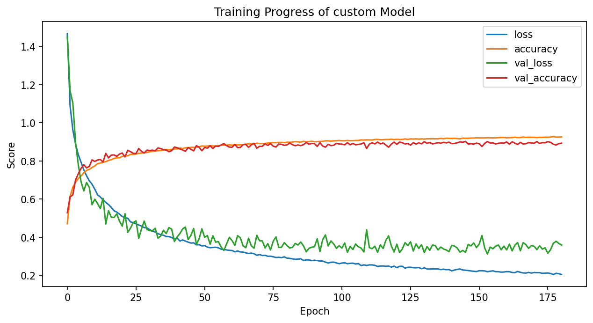
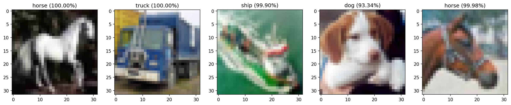

# CIFAR10 Image Classification with custom CNN

This repository shows the process of building and training a CNN model for image-classification using tensorflow and keras, taking the well known [CIFAR-10 dataset](https://www.cs.toronto.edu/~kriz/cifar.html) as an example. The model we are going to build will have a (comparably) simple architecture with (only) 420,842 parameters in total, but is still reaching an accuracy of over 89% on the test set.

The CIFAR-10 dataset consists of 60000 32x32 RGB images (50000 training images and 10000 for the test set) from ten different classes. Here are some examples from each of the categories: 

    Example images from CIFAR-10

## Model architecture

In the [notebook](CIFAR10-Classification.ipynb) we will train a model on an ImageGenerator with horizontal flip, slight height and width shift and rotation range of 17 degrees. In each layer we will use ELU-activation, Kernel-size of 3x3 and Same-padding and apply BatchNorm directly after each Convolution and before feeding the results to the Activation. The structure of the model will be as follows:

**Block 1**
- two Conv2D-layers with 32 filters
- MaxPooling2D with (2,2) and Stride=2 (so reduces feature map dimensions by 50%)
- 20%-Dropout 

**Block 2**
- two Conv2D-layers with 64 filters
- MaxPooling2D with (2,2) and Stride=2 
- 20%-Dropout 

**Block 3**
- two Conv2D-layers with 128 filters
- MaxPooling2D with (2,2) and Stride=2 
- 30%-Dropout 

**Block 4**
- Flatten input
- Dense-Layer with 64 hidden units
- 30%-Dropout 
- Softmax activation with 10 units, one for each class 

In addition to the Dropout-regularization, EarlyStopping with patience of 35 (total epochs specified: 200) with respect to validation accuracy is also used. 

As optimizer, Nadam with a learning rate of 0.0025 showed good results based on a batch size of 64.

## Trainig results

The following plot shows the loss and the accuracy for the training and the validation set over all epochs. EralyStopping finally recovered the weights from epoch 146, which lead to 89% accuracy on the test set.

    Training progress with loss and accuracy

## Prediction examples

The trained model can be found [here](./model). The following images show a few predicted examples with their respective class probability:

    Prediction examples with class probability

## Summary

The trained model reached a test accuracy of over 89% with a relatively simple model-structure and only minor overfitting due to different regularization techniques like Dropout, EarlyStopping and the use of an ImageGenerator. But there is still a lot of optimization potential especially regarding the architecture of the model (e.g. benchmark is [over 98% with ResNet](https://paperswithcode.com/sota/image-classification-on-cifar-10?tag_filter=3)).
